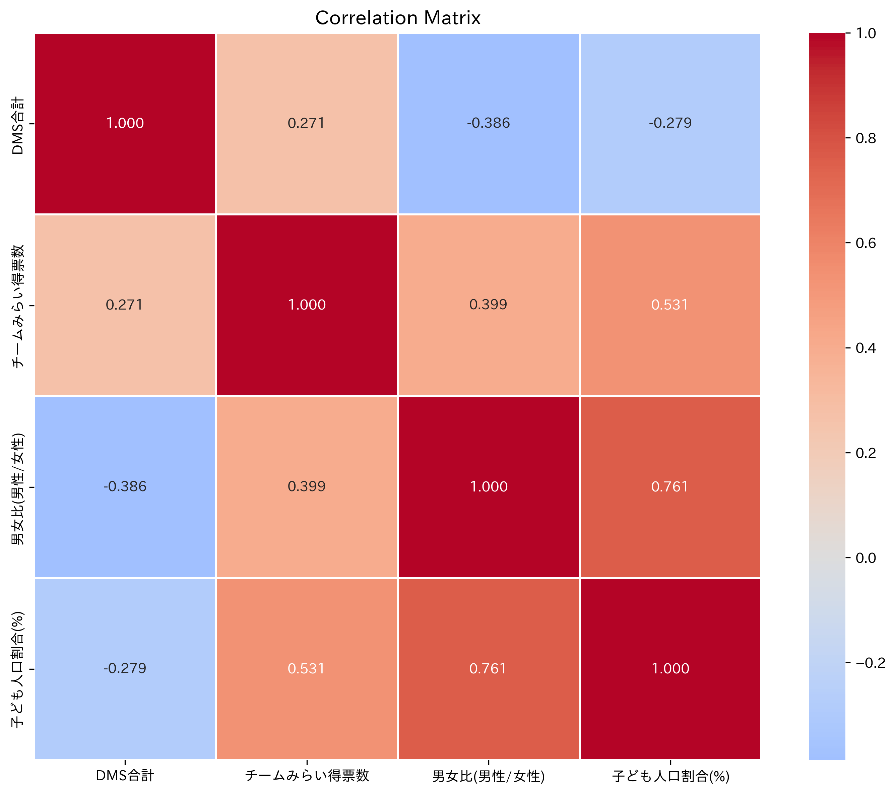

# 京都市における直接郵送（チラシ）配布と政治的得票への影響分析

## 背景

政治キャンペーンにおける郵便物の効果については、先行研究で様々な知見が示されている。米国で実施された1998年のランダム化比較試験（RCT）では、直接郵送による投票率への効果は小さく（1通あたり0.5ポイントの増加）、説得効果についても限定的であることが示されている[^1]。また、49の実地実験をメタ分析した研究では、非対面接触（オンライン広告、郵送物）の説得効果は対面接触と比較して低いことが報告されている[^2]。

二大政党制の米国では政党間を移動する有権者（説得効果）が少なく、既存支持者の投票率向上が重要とされている。しかし、日本の政治的文脈において、チラシの特定の政党への投票への寄与についての十分な定量的分析が不足している。

本研究では、2025年の参議院議員選挙において、京都市を対象として、国政政党「チームみらい」による直接チラシ配布が得票に与える影響を、人口統計学的要因を考慮して統計的に分析することを目的とした。京都市を選択した理由は、同団体が一定程度の配布活動を行っており、かつ選挙区に直接立候補していないことから、純粋なキャンペーン効果を観察できる可能性があるためである。

[^1]: Gerber, A. S., & Green, D. P. (2000). The effects of canvassing, telephone calls, and direct mail on voter turnout: A field experiment. American Political Science Review, 94(3), 653-663.
[^2]: Kalla, J. L., & Broockman, D. E. (2018). The minimal persuasive effects of campaign contact in general elections: Evidence from 49 field experiments. American Political Science Review, 112(1), 148-166.

## 方法

### データ収集

**チラシ配布データ**: チームみらいの活動マップ（https://action.team-mir.ai/map/posting） から手動で配布枚数を集計した。行政区をまたがる配布については、等分して各区に割り当てた。配布物は「機関誌」と「確認団体ビラ」の2種類に分類し、区別して集計した。

**人口統計・得票データ**: 京都市の公開データから、各行政区の人口、男女比、子ども人口割合、高齢化率、チームみらい得票数を取得した。

### 対象

京都市11行政区（北区、上京区、左京区、中京区、東山区、山科区、下京区、南区、右京区、西京区、伏見区）

### 分析手法

1. **記述統計**: 各変数の分布と基本統計量を算出
2. **単回帰分析**: チラシ配布数を説明変数、チームみらい得票数を目的変数とする線形回帰
3. **重回帰分析**: チラシ配布数、男女比、子ども人口割合を説明変数とする重回帰モデル（高齢化率は子ども人口割合と概念的に相反するため除外）
4. **多重共線性診断**: 分散拡大因子（VIF）による共線性の評価
5. **相関分析**: 変数間の相関関係の検討

統計解析にはPython（pandas, scipy, statsmodels）を使用し、有意水準は5%とした。

## 結果

### 記述統計

11行政区のチラシ配布数は0〜3,800枚（平均1,020枚、標準偏差1,386枚）と大きく異なっていた。配布が最も多かったのは中京区（3,800枚）、次いで下京区（3,000枚）、左京区（1,480枚）であった。一方、山科区、右京区、西京区、伏見区では配布記録がなかった（0枚）。

チームみらい得票数は332〜2,173票（平均1,284票、標準偏差516票）の範囲であった。最多得票は左京区（2,173票）、次いで伏見区（1,845票）、右京区（1,645票）であった。

**表1. 各行政区のチラシ配布数と得票数**

| 行政区 | チラシ合計 | チームみらい得票数 | 人口当たり得票割合(%) |
|--------|---------|-------------------|-------------------|
| 北区   | 100     | 1,102             | 0.94              |
| 上京区 | 1,200   | 986               | 1.18              |
| 左京区 | 1,480   | 2,173             | 1.31              |
| 中京区 | 3,800   | 1,776             | 1.61              |
| 東山区 | 500     | 332               | 0.91              |
| 山科区 | 0       | 869               | 0.64              |
| 下京区 | 3,000   | 1,162             | 1.40              |
| 南区   | 170     | 983               | 0.96              |
| 右京区 | 0       | 1,645             | 0.81              |
| 西京区 | 0       | 1,257             | 0.84              |
| 伏見区 | 0       | 1,845             | 0.66              |

### 単回帰分析

チラシ配布数とチームみらい得票数の単回帰分析の結果、以下が得られた：

- **回帰式**: y = 0.1073x + 1184.5643
- **相関係数**: r = 0.271（弱い正の相関）
- **決定係数**: R² = 0.074（説明力7.4%）
- **p値**: 0.420（統計的に有意ではない）

この結果は、チラシ配布数単独では得票数の変動をほとんど説明できないことを示している。

**図1. チラシ配布数と得票数の散布図**

図1は、チラシ配布数（横軸）とチームみらい得票数（縦軸）の関係を示している。回帰直線の傾きは緩やかで、決定係数R² = 0.074と低い値を示している。左京区（左）が回帰直線から大きく上方に外れており、チラシ配布に対して高い得票効率を示している一方、中京区（中）と下京区（下）は多くのチラシを配布したにも関わらず、期待される得票数を下回っている。

### 重回帰分析

チラシ配布数、男女比、子ども人口割合を説明変数とする重回帰分析では：

- **決定係数**: R² = 0.487（説明力48.7%）
- **調整済み決定係数**: 0.267
- **F統計量のp値**: 0.174（モデル全体として統計的に有意ではない）

各変数の回帰係数：
- チラシ合計: 0.194（p = 0.139）
- 男女比: 1,885.3（p = 0.674）  
- 子ども人口割合: 221.8（p = 0.251）

全ての変数で統計的有意性は認められなかった。

**表2. 重回帰分析の結果（高齢化率除外後）**

| 変数               | 回帰係数    | 標準誤差  | t値   | p値   | 95%信頼区間        |
|-------------------|------------|----------|-------|-------|--------------------|
| 切片              | -2,652.4   | 2,854.6  | -0.93 | 0.384 | [-9,402, 4,098]   |
| チラシ合計        | 0.194      | 0.116    | 1.67  | 0.139 | [-0.08, 0.47]     |
| 男女比(男性/女性)  | 1,885.3    | 4,293.6  | 0.44  | 0.674 | [-8,267, 12,038]  |
| 子ども人口割合(%) | 221.8      | 177.4    | 1.25  | 0.251 | [-198, 641]       |

### 多重共線性診断

**表3. 多重共線性診断（VIF値）**

| 変数               | VIF   |
|-------------------|-------|
| チラシ合計        | 1.18  |
| 男女比(男性/女性)  | 2.58  |
| 子ども人口割合(%) | 2.38  |

### 相関分析

**図2. 変数間相関行列**

図2は主要変数間の相関関係をヒートマップで示している。注目すべき相関関係：
- チームみらい得票数と子ども人口割合: r = 0.531（中程度の正の相関）
- 男女比と子ども人口割合: r = 0.761（強い正の相関）  
- チラシ合計とチームみらい得票数: r = 0.271（弱い正の相関）

高齢化率を除外したことにより、より解釈しやすい相関構造が得られた。チラシ配布は子ども人口割合の高い地域（若い世代が多い地域）で効果的である可能性が示唆される。

## 考察

### 主な知見

本分析の結果、京都市におけるチラシ配布は「チームみらい」の得票数に統計的に有意な影響を与えていない可能性が示された。これは以下の要因によるものと考えられる：

1. **効果サイズの小ささ**: 先行する米国研究と同様、直接郵送の効果は限定的である可能性がある。改訂後の重回帰モデルでは、チラシ1,000枚の増加に対して約194票の増加を示唆するが、統計的有意性はない（p = 0.139）。

2. **人口統計学的要因の重要性**: 重回帰分析では説明力が48.7%であり、子ども人口割合との相関（r = 0.531）が最も強く、人口構成がより重要な予測因子である可能性がある。高齢化率を除外したことで多重共線性が改善され、より安定したモデルが得られた。

3. **配布戦略の地域性**: チラシ配布が集中した中京区・下京区では必ずしも高い得票率を示さず、配布戦略と得票効率の関係は単純ではない。

### 限界（Limitation）

#### Information Bias（情報バイアス）

本研究の最大の限界は**情報バイアス**である：

1. **不完全な配布データ**: 活動マップに反映されていない配布活動が存在する可能性が高い。実際の配布数は記録された数値を上回る可能性がある。

2. **報告バイアス**: マップへの投稿は自発的であり、地域や活動者によって報告頻度に差がある可能性がある。

3. **分類の不正確性**: 行政区をまたがる配布を等分割したが、実際の配布範囲は異なる可能性がある。

#### その他の限界

- **サンプルサイズ**: 11区という小サンプルのため統計的検出力が不足
- **観察研究の限界**: 因果推論には限界があり、相関関係の分析に留まる
- **交絡因子**: 他の政治活動や媒体報道などの影響を統制できていない
- **時間的要因**: 配布タイミングと選挙までの期間の影響を考慮していない

### 今後の研究への示唆

より精確な効果測定のためには、以下が必要である：

1. **より完全なデータ収集**: 全配布活動の系統的な記録
2. **実験的デザイン**: RCTによる因果効果の推定
3. **より大きなサンプル**: 複数地域・複数選挙の分析
4. **質的調査**: 有権者への直接調査による効果メカニズムの解明

## 結論

京都市における本分析では、直接郵送配布と政治的得票の間に統計的に有意な関係は認められなかった。ただし、情報バイアスをはじめとする方法論的限界がある。

政治キャンペーンにおけるチラシの効果を正確に評価するためには、より厳密なデータ収集と実験的デザインが必要であり、現段階では効果の有無について確定的な結論を下すことは困難である。